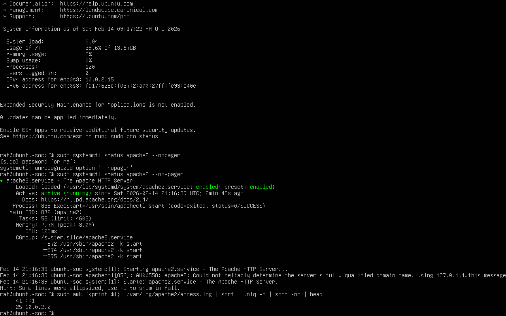

# Apache Log Analysis Investigation

## Scenario
Suspicious HTTP activity was observed on an Apache web server.  
The objective was to analyze access logs to identify abnormal request patterns and potential brute-force or enumeration behavior.

---

## Tools Used
- Ubuntu Linux
- Apache2
- /var/log/apache2/access.log
- systemctl
- grep
- awk
- sort
- uniq

---

## Investigation Steps
- Verified Apache service status using `systemctl status apache2`
- Reviewed access logs located at `/var/log/apache2/access.log`
- Identified top source IP addresses by request frequency
- Filtered login-related requests (e.g., `/login`)
- Counted repeated requests from the same IP

---

## Findings
- Repeated requests from specific IP addresses were identified
- High-frequency requests indicated abnormal behavior
- Login-related endpoints showed suspicious repetition patterns

---

## Evidence

### Evidence 2 – Apache Service Status

### Evidence 3 – Top Source IP Requests

### Evidence 4 – Suspicious Login Filtering

