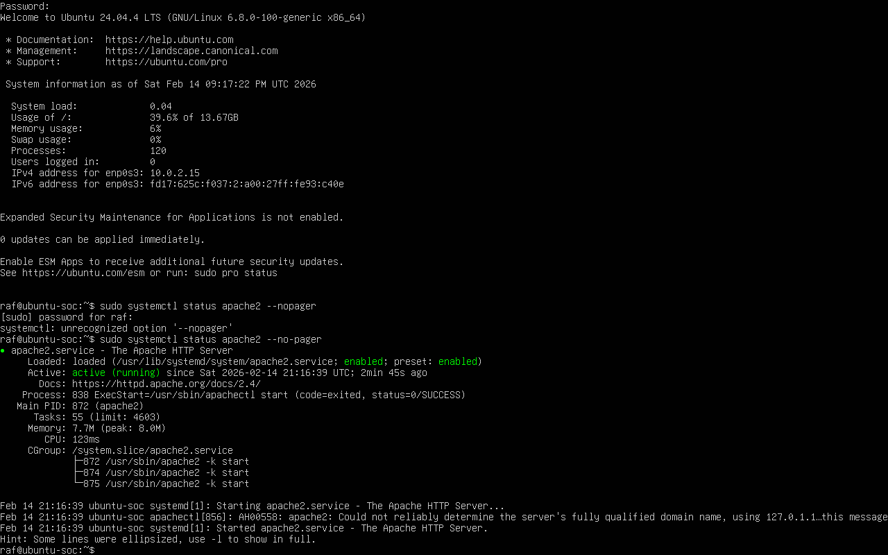

# SSH Brute Force Investigation

## Scenario
Multiple failed SSH login attempts were detected from a single IP address against a Linux server.

## Objective
Investigate authentication logs to determine if a brute force attack occurred.

## Tools Used
- Linux (Ubuntu VM)
- auth.log
- grep
- journalctl

## Investigation Steps
- Reviewed authentication logs
- Filtered failed SSH login attempts
- Identified source IP generating repeated failures
- Correlated timestamps and login behavior

## Findings
Repeated failed login attempts from the same IP indicate brute force activity.

## Response Actions (Simulated)
- Block source IP
- Recommend account lockout policy
- Enable fail2ban
- Monitor for persistence attempts

## Key Learning
This investigation demonstrates detection of brute force attacks using log analysis and basic Linux commands.
## Evidence 1 – Failed SSH Login Attempts

## Evidence 2 – Repeated Attempts from Same IP

## Evidence 3 – SSH Service Status (Running)

### Evidence 3

